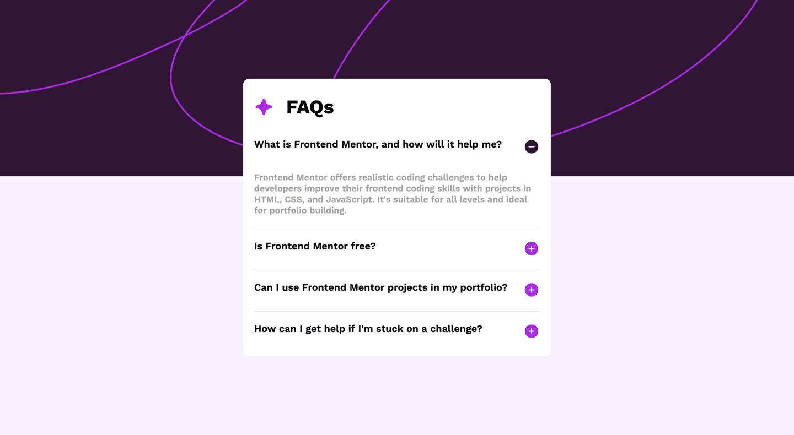
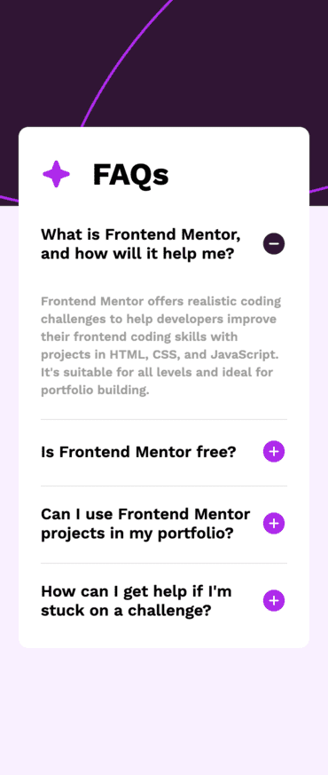

# Frontend Mentor - FAQ accordion solution

This is a solution to the [FAQ accordion challenge on Frontend Mentor](https://www.frontendmentor.io/challenges/faq-accordion-wyfFdeBwBz). Frontend Mentor challenges help you improve your coding skills by building realistic projects.

## Table of contents

- [Overview](#overview)
  - [The challenge](#the-challenge)
  - [Screenshot](#screenshot)
  - [Links](#links)
- [My process](#my-process)
  - [Built with](#built-with)
  - [Continued development](#continued-development)
  - [Useful resources](#useful-resources)
- [Author](#author)

## Overview

### The challenge

Users should be able to:

- Hide/Show the answer to a question when the question is clicked
- Navigate the questions and hide/show answers using keyboard navigation alone
- View the optimal layout for the interface depending on their device's screen size
- See hover and focus states for all interactive elements on the page

### Screenshot

### Links

- Solution URL: [GitHub](https://github.com/JetMars/fmentor-faq-accordion)
- Live Site URL: [Versel](https://fmentor-faq-accordion.vercel.app)

## My process

### Built with

- Semantic HTML5 markup
- CSS custom properties
- Flexbox
- Mobile-first workflow
- [React](https://reactjs.org/) - JS library
- [Next.js](https://nextjs.org/) - React framework
- [Framer Motion](https://www.framer.com/motion/) - Framer Motion animation library

### Continued development

I'll want to know more about Framer Motion and use it in my projects.

### Useful resources

- [Accordion React](https://webformyself.com/kak-sozdat-accordion-react-s-nulya-bez-ispolzovaniya-vneshnej-biblioteki/) - This article helped me. I really liked this pattern and will use it going forward.
- [Youtube](https://www.youtube.com/watch?v=_94vYQtaz1Y&list=PLiZoB8JBsdzkn1yqxUaprfLYzdS-1jhJE) - This video helped me to understand how Framer Motion works and it gave me basic knowledge.

## Author

Frontend Mentor - [@JetMars](https://www.frontendmentor.io/profile/JetMars)
